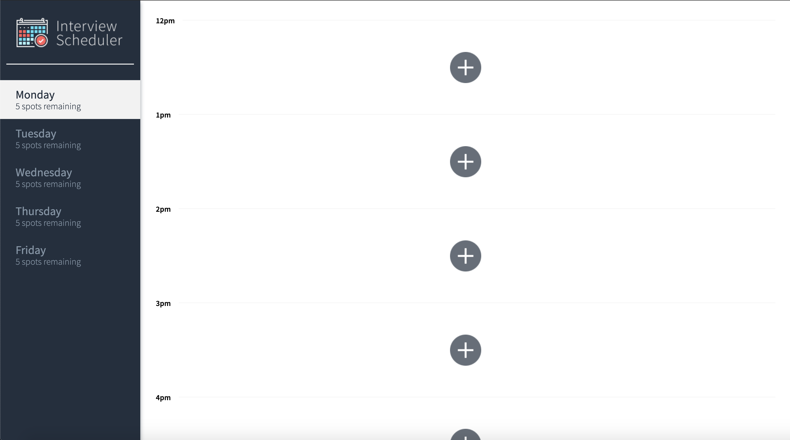
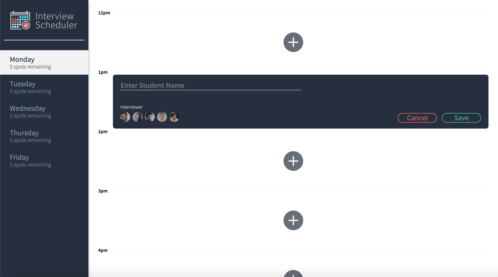
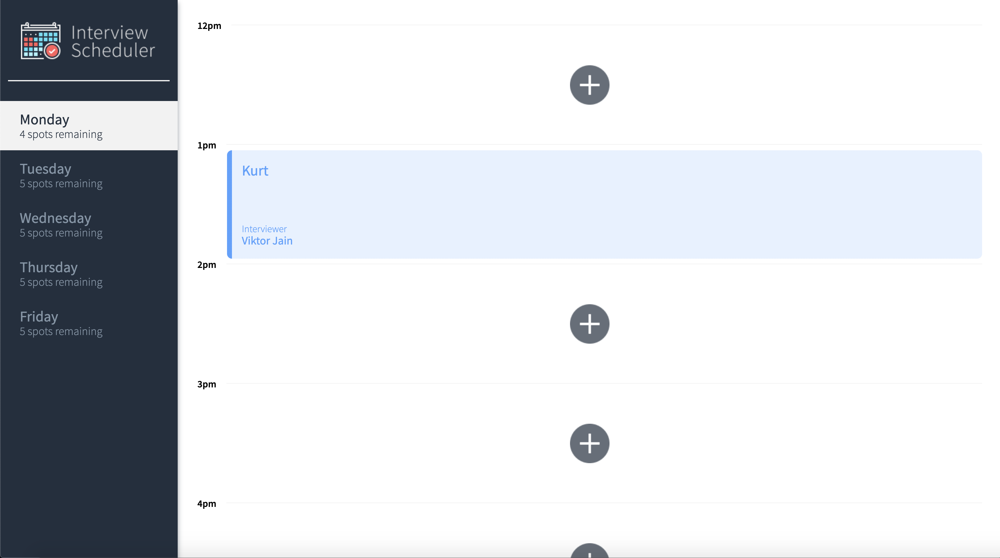

# Interview Scheduler

## About
[Interview Scheduler](https://nifty-poincare-b9a997.netlify.app/ "Interview Scheduler Home Page") is a fully deployed React app for scheduling interviews with mentors live, with the help of WebSockets.





### Stack
- React 
- Webpack
- Babel
- Axios
- WebSockets

### Testing
- Storybook
- Webpack Dev Server
- Jest
- React Testing Library
- Cypress

### Deployment
- Heroku (API)
- Netlify (Client)
- CircleCI (Client)

## Reflection
- Developed as part of the Lighthouse Labs Web development bootcamp.
- I set out to build a deployment pipeline focusing heavily on effective testing of React apps.
- Achieving a higher than 80% test coverage was more challenging than expected, but I was very impressed with the Cypress API.
- Being my first time using CircleCI, I look forward to taking a deep dive post bootcamp, and exploring more of what it has to offer.

## Setup

Install dependencies with `npm install`.

## Running Webpack Development Server

```sh
npm start
```

## Running Jest Test Framework

```sh
npm test
```

## Running Storybook Visual Testbed

```sh
npm run storybook
```